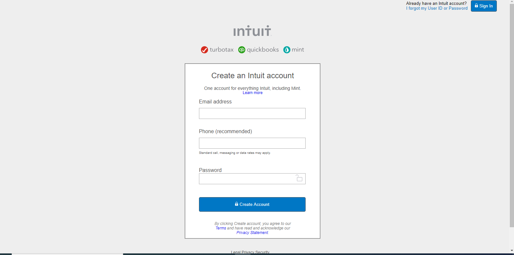

# HTML forms

> This HTML document matches close to the appearance of [mint.com](https://www.mint.com/)’s signup page

## Built With

- HTML,
- CSS,
- Flexbox

## Live Demo

[Live Demo Link]( https://emmanuelaaron.github.io/HTML-forms/)

## Getting Started
Clone this repo on your local machine

### Prerequisites
To make this repository working in your local machine you need only a browser.

## Authors

👤 **Emmanuel Isabirye**

- Github: [@githubhandle](https://github.com/Emmanuelaaron)
- Twitter: [@twitterhandle](https://twitter.com/EmmanuelIsabir1)
- Linkedin: [linkedin](https://www.linkedin.com/in/fullstackwebdev-emma/)

## 🤝 Contributing

Contributions, issues and feature requests are welcome!

Feel free to check the [issues page](issues/).

## Show your support

Give a ⭐️ if you like this project!

## Acknowledgments

- Great Thanks to [Marcos Hernandez](https://github.com/marcoshdezcam) for the support given during the execution of this project

## 📝 License

This project is [MIT](lic.url) licensed.
